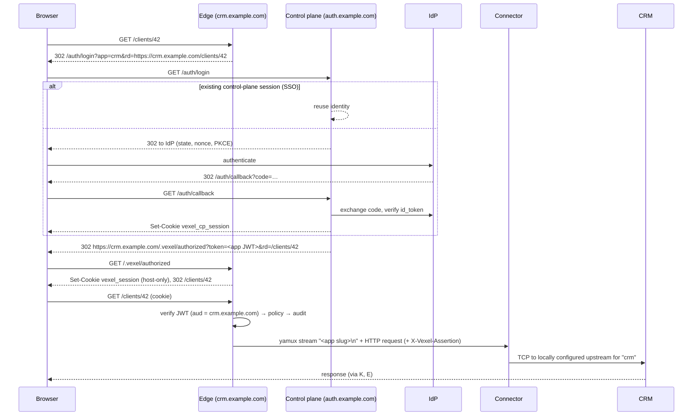

# Vexel architecture

Vexel is a zero-trust access service: private applications (a CRM, an admin
panel, an internal API) are never exposed to the internet. Every request goes
through a Vexel edge, which checks **who** the user is, **what** device they
are on, and **whether policy allows it** before forwarding it down an outbound
tunnel to the application.

## Components

```
 Browser / device client                 Vexel (SaaS)                         Customer network
 ───────────────────────     ─────────────────────────────────────     ──────────────────────────
                             ┌──────────────── edge ───────────────┐
  GET crm.example.com ─────▶ │ :8080  identity-aware proxy         │
                             │  1. route by Host                   │      ┌────────────┐
                             │  2. verify session cookie (JWT)     │◀═════│ connector  │──▶ CRM
                             │  3. evaluate policy                 │ WSS  │ (outbound  │    :9000
                             │  4. audit                           │ yamux│  only)     │
                             │  5. forward over tunnel stream      │      └────────────┘
                             │ :8082  tunnel endpoint              │
                             └──────▲───────────────┬──────────────┘
                                    │ config poll   │ JWKS
                                    │ (ETag)        │
                             ┌──────┴───────────────▼──────────────┐
  login redirects ─────────▶ │ control plane  :8081                │ ◀──▶ IdP (OIDC)
                             │  /auth/*   login, SSO session       │
                             │  /.well-known/jwks.json             │
                             │  /api/v1/edge/config  snapshot      │
                             └─────────────────────────────────────┘
```

| Component | Code | Runs where | Job |
|---|---|---|---|
| Edge | `cmd/edge`, `internal/edge` | Vexel regions | TLS termination, authN, policy, audit, proxying |
| Tunnel | `internal/tunnel` | edge + connector | One outbound WebSocket per connector, yamux-multiplexed streams |
| Connector | `cmd/connector` | customer network | Dials the edge, forwards streams to local upstreams |
| Control plane | `cmd/controlplane`, `internal/controlplane` | Vexel core | Per-tenant OIDC login, token signing, JWKS, edge config API, admin API ([API.md](API.md)) |
| Store | `internal/store` | Vexel core | Postgres (prod) / in-memory (tests, dev), one conformance suite for both |
| Admin dashboard | `web/`, `internal/controlplane/dashboard.go` | served by the control plane at `/admin/` | Tenant admin UI over the same admin API |
| Device trust | `internal/controlplane/device.go`, `web/dashboard/assets/device.js` | control plane + user's browser | Enrolls hardware-bound WebAuthn credentials and checks them at sign-in |
| Policy engine | `internal/policy` | edge | Ordered include / require / exclude rules, default deny |
| App SDK | `pkg/vexelauth`, `pkg/jwks` | inside customer apps | Verify the `X-Vexel-Assertion` header |
| Audit / access log | `internal/audit`, `internal/store/accesslog*.go` | edge + control plane | Buffered event pipeline; edges ship batches to the control plane, which stores them in the tenant-searchable access log |
| Operator CLI | `cmd/vexelctl` | operator laptop | Token, signing-key and encryption-key generation |

## Login and request flow



## Security properties (and where they're enforced)

| Property | Mechanism | Code |
|---|---|---|
| Apps have no public ingress | Connector dials out; edge never dials customers | `tunnel/client.go` |
| Edge can't pivot inside customer networks | Connector maps app slug → upstream from **its own** config, not from the edge | `tunnel/client.go` `handle` |
| Tokens are app-scoped | `aud` = app hostname; edge verifies it per request | `edge/handler.go` `session` |
| No open redirects | Login only redirects to the app's own hostname; `/.vexel/authorized` only to relative paths | `controlplane/auth.go` `target`, `edge/handler.go` `safeRedirect` |
| Identity headers can't be spoofed | Edge strips all client `X-Vexel-*` headers before adding its own; apps verify the signed assertion | `edge/proxy.go` |
| Session cookie doesn't leak upstream | Edge removes `vexel_session` from forwarded requests | `edge/proxy.go` `stripCookie` |
| Default deny | No matching policy ⇒ 403 | `policy.Evaluate` |
| Policy changes apply immediately | Policy is evaluated per request at the edge, not baked into tokens | `edge/handler.go` |
| Credential revocation | Edge closes connector sessions whose token is no longer in the snapshot | `tunnel.Registry.Revoke` |
| Only hashes at rest | Edge/connector tokens are stored as SHA-256 | `internal/secret` |
| Dev shortcuts can't reach prod | `dev_login` requires `dev_mode`; non-dev requires https, Secure cookies, a persistent key | `controlplane/config.go` |
| Edge survives control-plane outage | Edge keeps serving its last good snapshot | `edge.Sync` |
| Tenants are isolated | Every store query filters on `tenant_id`; API handlers only see the token's tenant; tests attempt cross-tenant reads and writes | `internal/store`, `storetest` `TenantIsolation` |
| A tenant can't use another's connector | Composite FK `(connector_id, tenant_id)`; the edge also skips apps whose connector belongs to another tenant | `0001_init.sql`, `edge.compile` |
| A tenant can't claim someone else's hostname | Hostnames must sit under `*.<tenant>.<apps_domain>` | `controlplane/admin.go` `checkHostname` |
| Sessions don't cross tenants | Tokens carry `tid`; the edge checks it against the app; SSO reuse requires the same tenant | `edge.verifyAppToken`, `controlplane.handleLogin` |
| Offboarding is near-instant | Disabled users ship in the snapshot; edges reject their live sessions on the next sync and login refuses them | `edge.verifyAppToken`, `finishAuthentication` |
| One tenant can't stall config for all | The edge skips an invalid app instead of rejecting the whole snapshot | `edge.compile` |
| IdP secrets are encrypted at rest | AES-256-GCM bound to the tenant ID; write-only over the API | `secret.Box`, `controlplane/admin.go` |
| Who opened what is on record | Every proxied request and sign-in is stored with user, app, path, IP, edge and matching policy; searchable and exportable per tenant | `edge/handler.go`, `controlplane/accesslog.go` |
| Access records don't outlive their purpose | Retention job deletes events older than `access_log_retention` (default 90 days), in batches | `controlplane.RunRetention` |
| Edges can't impersonate each other in the log | The control plane stamps each ingested event with the authenticated edge's ID, overriding anything sent | `handleEdgeEvents` |
| CSV exports can't carry spreadsheet formulas | Cells starting with `= + - @` are prefixed with `'` | `csvSafe` |
| Apps can be confined to company devices | `trusted_device` rule; sign-in asks the platform authenticator (TPM / Secure Enclave key, user verification required) to sign a fresh challenge | `controlplane/device.go`, `policy` |
| A device key can't be copied to another machine | Platform authenticators only; backup-eligible (syncable passkey) credentials are refused unless `allow_synced_device_credentials` | `handleEnrollFinish` |
| Only admins decide which devices are trusted | Enrollment needs a one-time, 24 h link an admin issues for a named user; consumed atomically | `CompleteDeviceEnrollment` |
| A device counts only for its owner and tenant | Edge checks the token's device is active, in the app's tenant, and enrolled to the signed-in user | `edge.trustedDevice` |
| Revocation reaches open sessions | Revoked devices drop out of the snapshot; edges stop accepting the device claim at the next sync | `RevokeDevice`, `edge.trustedDevice` |
| Cloned keys are caught | WebAuthn signature counter regression rejects the assertion | `handleDeviceFinish` |
| Every admin change is attributable | Admin audit records actor (`user:<email>`, `token:<name>`, operator, seed), action and target | `admin.record` |
| Dashboard writes can't be forged cross-site | Cookie-authenticated writes need the session's CSRF secret (only readable same-origin) and a matching `Origin`; cookie is `HttpOnly`, `SameSite=Lax` | `api.go` `authSession` |
| Dashboard access tracks the directory | Admin role and disabled status are re-checked on every API call, not cached in the session | `authSession` |
| A tenant can't lock itself out | Demoting or disabling the last active admin is refused | `admin.keepOneAdmin` |
| Dashboard resists XSS | No `innerHTML`; all text via DOM text nodes; CSP `script-src 'self'`, `frame-ancestors 'none'`, no third-party origins | `web/dashboard/assets/dom.js`, `dashboard.go` |

## Data model

Postgres schema in `internal/store/migrations/`, applied automatically at
startup under an advisory lock:

| Table | Holds |
|---|---|
| `tenants` | slug, name |
| `identity_providers` | one OIDC provider per tenant, client secret sealed |
| `users` | created on first login or by invite; `role` (member/admin), groups refreshed each login, `disabled_at` |
| `connectors` | token hash per connector |
| `apps` | hostname, slug, connector, session length, ordered policies (jsonb) |
| `api_tokens` | tenant admin token hashes |
| `admin_audit` | who changed what |
| `config_state` | single revision counter |
| `access_events` | access log: one row per decision or sign-in, indexed by tenant + time and tenant + user |
| `connector_sessions` | each edge's latest heartbeat of live connector sessions |
| `devices` | trusted devices: one WebAuthn credential (public key, sign counter) per device, owned by a user |
| `device_enrollments` | one-time enrollment links (hashed code, user, expiry, used_at) |

**Config propagation.** Every write that changes what edges enforce (apps,
connectors, disabled users) bumps `config_state.revision` in the same
transaction. Edges poll `/api/v1/edge/config` with `If-None-Match`; the control
plane reads the revision and rebuilds the snapshot only when it moved. Because
the revision lives in Postgres, any number of control plane replicas serve
identical snapshots and ETags.

**Access log pipeline.** Edges emit an event per proxied request; the audit
logger batches them (≤ 1 s) and posts them to `/api/v1/edge/events` with
retries. Each event carries an ID generated at the edge, so a retried batch
is a no-op (`ON CONFLICT DO NOTHING`). The control plane writes its own
sign-in events to the same log. Events are also printed as JSON lines on
stdout for external log shipping.

The access log sits behind its own `store.AccessLog` interface. Postgres is
fine for a single firm's volume (tens of millions of rows, indexed by tenant
and time); at multi-tenant SaaS scale the same interface can be backed by
ClickHouse without touching edges or the API.

**Device trust.** An admin issues a one-time link for a user; opened on the
laptop, it registers a platform authenticator credential whose private key
lives in the TPM or Secure Enclave. When a user signs in to an app whose
policies use `trusted_device`, the control plane asks for an assertion from
one of that user's devices (with PIN / biometric verification), and records
the device in the session and the app token (`did`). Edges accept the claim
only while the device is in the snapshot's trusted list for that tenant and
user, so revoking takes effect within one sync. Single sign-on reuses a
proven device; a fresh primary sign-in proves it again. Sessions from before
an app required a device are sent back through sign-in once (`dchk` claim)
rather than refused. Device *posture* (disk encryption, OS version) needs an
agent and is not covered yet.

**Connector health.** Edges post their live sessions every sync interval and
immediately when a connector connects or disconnects. A connector is online
if any edge reported a session for it in the last 45 s, so a crashed edge's
connectors go offline on their own.

## Roadmap

| Version | Scope |
|---|---|
| v0.1 (done) | Edge proxy, tunnel, connector, OIDC + dev login, SSO session, policy engine, JWKS, assertion SDK, audit to stdout, e2e test |
| v0.2a (done) | Postgres store, migrations, multi-tenancy, per-tenant OIDC, admin + operator API, encrypted IdP secrets, user offboarding, admin audit |
| v0.2b (done) | Admin dashboard, admin roles and invites, browser sessions on the admin API with CSRF + Origin checks, last-admin guard |
| v0.2c (done) | Searchable access log (edge → control plane ingestion, filters, CSV export, retention), connector health with host/version in the dashboard |
| v0.3a (done) | Device trust with hardware-bound WebAuthn credentials: admin-issued enrollment links, `trusted_device` rule, device check at sign-in, revocation, device in the access log |
| **next** | NATS config push (policy, offboarding and revocation in under a second instead of one sync), custom domains (ownership proof + ACME) |
| v0.3b | Device posture via a small agent (disk encryption, OS version, screen lock) as policy selectors; optional mTLS device certificates |
| later | ClickHouse backend for the access log at SaaS scale |
| v0.4 | SIEM export (S3, Splunk, webhook), SCIM provisioning, GeoIP `country` selector, trusted-proxy `X-Forwarded-For` handling, billing |
| Later | Non-HTTP access (SSH/RDP/TCP over WireGuard), browser isolation, DLP, anycast edge |

## Production checklist (not yet done)

- Rate limiting on `/auth/*`, the admin API and the tunnel endpoint
- Postgres row-level security as a second line of defence behind query scoping
- Write the admin audit row in the same transaction as the change
- Signing key rotation (publish next key in JWKS before switching)
- Metrics (Prometheus) and tracing (OpenTelemetry)
- Connector auto-update and version reporting
- Load testing the edge
- External security review / pen test before the first paying customer
